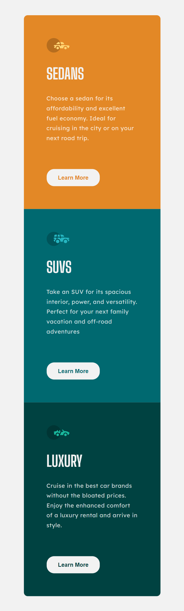

# Frontend Mentor | 3-column preview card component

This is a solution to the [3-column preview card component](https://www.frontendmentor.io/challenges/3column-preview-card-component-pH92eAR2-). Frontend Mentor challenges help you improve your coding skills by building realistic projects. 

## Table of contents

- [Overview](#overview)
  - [The challenge](#the-challenge)
  - [Screenshot](#screenshot)
  - [Links](#links)
- [My process](#my-process)
  - [Built with](#built-with)
  - [What I learned](#what-i-learned)
  - [Continued development](#continued-development)
  - [Useful resources](#useful-resources)
- [Author](#author)

## Overview

### The challenge

Users should be able to:

- View the optimal layout depending on their device's screen size

### Screenshot




### Links

- Solution URL: ()
- Live Site URL: ()

## My process

### Built with

- Semantic HTML5 markup
- CSS custom properties
- Flexbox
- Mobile-first workflow


### What I learned

```css
/* Btn3 Styling */

.btn3 button {
    border: none;
    padding: .7rem 1.5rem;
    border-radius: 1rem;
    color: var(--very-dark-cyan);
    margin-top: 2rem;
    font-weight: 550;
    font-size: var(--font-size-p);
} 

.btn3 button:hover {
    padding: .63rem 1.43rem;;
    color: var(--very-light-gray-background-headings-btn);
 }

.button3 {
    background-color: var(--very-light-gray-background-headings-btn);
 }

.button3:hover {
    background-color: var(--very-dark-cyan);
    border: 2px solid var(--very-light-gray-background-headings-btn);
 }
```
### Continued development

I'm still not completely comfortable with flexbox and grid techniques.

### Useful resources

- (https://www.w3schools.com/tags/tryit.asp?filename=tryhtml_button_css)
This helped me with change the background color of a button with the background-color property. 
The button element - Styled with CSS.

## Author

- Website - [Dorota Mroz]
- Frontend Mentor - [@DorotaMroz](https://www.frontendmentor.io/profile/DorotaMroz)
